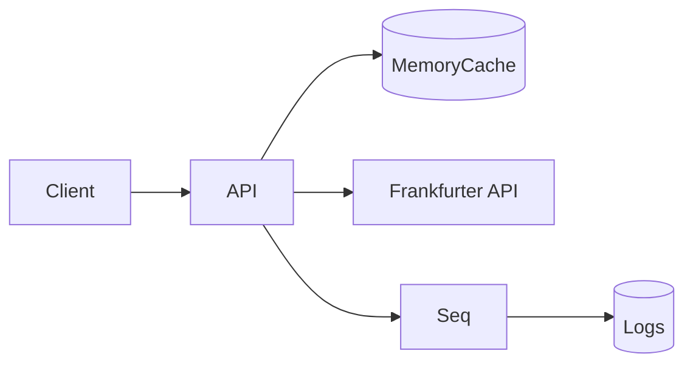

# Currency Converter API


## Table of Contents
1. [Features](#-features)
2. [Setup](#%EF%B8%8F-setup)
3. [API Documentation](#-api-documentation)
4. [Technical Details](#-technical-details)
5. [Assumptions Made](#-assumptions-made)

## 🌟 Features
✔ **Core Functionality**
- Real-time currency conversion
- Historical exchange rate lookup
- Currency blacklist management

✔ **Security**
- JWT authentication
- Role-based authorization (Admin/User)
- IP rate limiting

✔ **Observability**
- OpenTelemetry instrumentation
- Seq log aggregation
- Health check endpoint

## 🛠️ Setup

### Installation
```bash

# Clone repository
git clone https://github.com/izemc/currency-converter.git
cd currency-converter

# Start services
docker-compose up -d --build

```

## 📚 API Documentation

### 🔗 Access Endpoints

- **API Base URL**: [http://localhost:8080](http://localhost:8080)
- **API Documentation**: [http://localhost:8080/docs](http://localhost:8080/docs)
- **Seq Logging Dashboard**: [http://localhost:5342](http://localhost:5342)

---

### 👥 Pre-configured Users

The system automatically seeds the following users on startup:

| Username | Password   | Role  |
|----------|------------|-------|
| admin    | Admin@123  | Admin |
| user     | User@123   | User  |

---

### 🔐 API Usage

### Authentication

**Endpoint**: `POST /api/v1/Auth/login`  
**Content-Type**: `application/json`

#### Request Body
```json
{
  "username": "admin",
  "password": "Admin@123"
}
```

### 📡 Available Endpoints

| Method | Path                           | Description             | Access     |
|--------|--------------------------------|-------------------------|------------|
| GET    | `/api/v1/Currency/latest?baseCurrency=EUR`                                  | Current exchange rates  | All users  |
| POST   | `/api/v1/Currency/convert`                                                  | Convert currency        | All users  |
| GET    | `/api/v1/Currency/historical?BaseCurrency=EUR&StartDate=2025-05-01`         | Past rates              | Admin only |

---

## ⚙️ Technical Details

### 🏗️ System Architecture



### 🧩 Key Components

- Automatic user seeding on startup
- Currency blacklist: `TRY`, `PLN`, `THB`, `MXN`
- Polly retry policies: 3 attempts
- Circuit breaker: 5 failures → 30s pause

---

## 🔍 Assumptions Made

### Authentication
- JWT bearer tokens are used for authentication  
- Admin role required for historical rates access  
- Tokens are validated against configured issuer/audience  

### Rate Limiting
- IP-based rate limiting (10 requests/minute default)  
- In-memory store for rate limiting counters

## Memory Caching
  - API responses cached in-memory (1 hour TTL)
  - Repository data stored in memory lists (no database)


